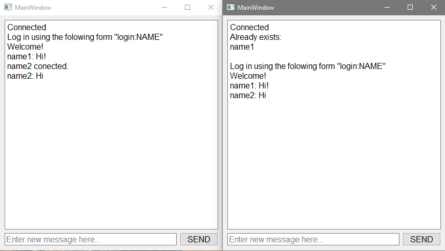

## Asynchronous client-server Chat with PyQT5 interface.


# Download & Setup Instructions :
* Clone the project. This will download the GitHub respository files onto your local machine.</br>
```Shell
git clone https://github.com/teredet/Chat
```
* Create a virtual environment and activate
```Shell
    pip install virtualenv
    python -m virtualenv envname
    envname\scripts\activate
```
* Install requirements
```Shell
    cd Chat
    pip install -r requirements.txt
```
* Run server
```Shell
    python server.py
```
* Run client
```Shell
    python client.py
```

# Features
* Users can log in.
* When a new user is connected, it is written who is already in the chat.
* When a new user logs in, a message is written to the rest of the users about the connection of the new user. 
# Tech Stack
* Python
* PyQt5
* Twisted

